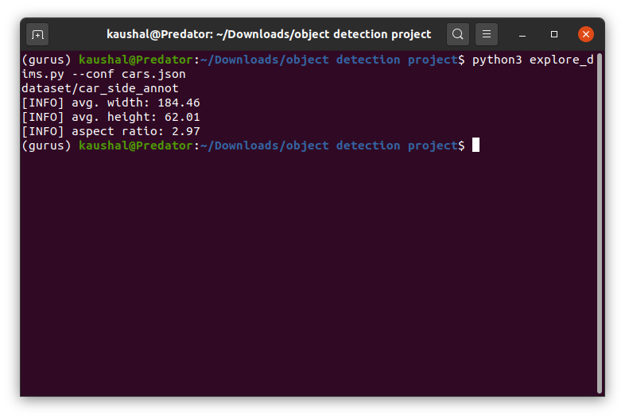
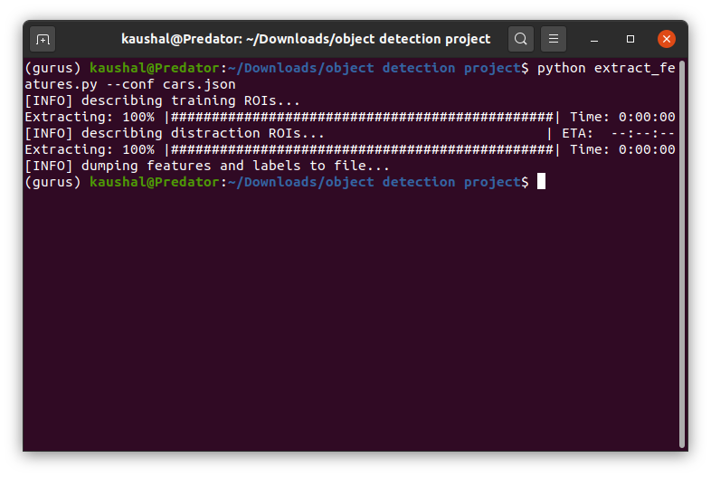
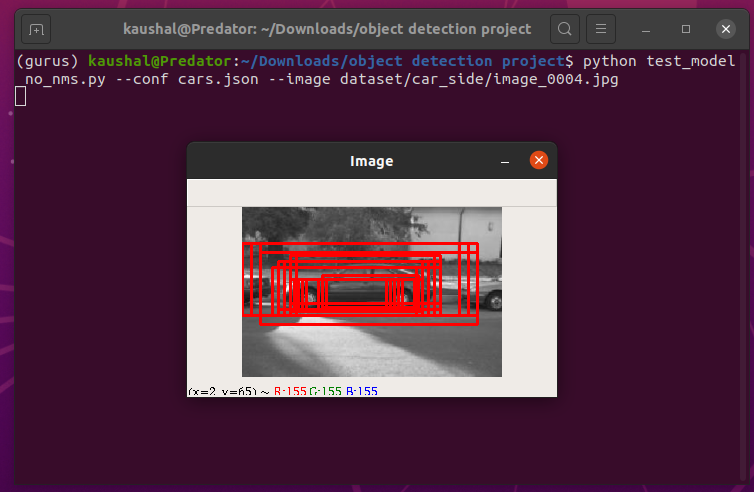
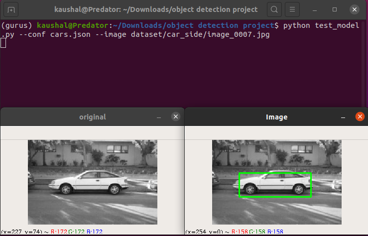

# Object Detection with non maxima suppression and hard negative mining

### Steps included in the project 
> 1. Exploring the data
> 2. Feature extraction
> 3. Detector training
> 4. Non Maxima suppression
> 5. Hard negetive mining
> 6. Detection retraining 

I'll list down how to run the project step by step so you can follow along and also give you a brief about the step as well.

## The Data
We'll be using the [Caltech - 101](http://www.vision.caltech.edu/Image_Datasets/Caltech101/) dataset.
In order to maintain cohesive examples, we’ll be using the car_side  data from CALTECH-101, a collection of car images taken from a side view
You can either download the whole dataset with annotation from the given link or you can use the data which I have provided. I have given the data which I used to train the model. This data is just the car-side subfolder of the Caltech 101 dataset

I have also used the [SceneClass-13](http://vision.stanford.edu/resources_links.html) dataset. This data is used as distraction images for negative samples.

## Features of Projects / Algorithms / Methods used
> * Linear SVM Classifier
> * Data Analysis
> * Non-maxima suppression
> * Hard-negative mining
> * Built on OpenCV and dlib
> * Histogram of oriented gradients as descriptor


## Goal:

> Once trained, our object detector will be able to detect the presence (or lack thereof) of a car in an image, followed by drawing a bounding box surrounding it

Again, this framework is not specific to side views of cars — it can be used to create any custom object detector of your choice. The car_side  choice is simply an example we will use for this project

## File description

> * cars.json : This file contains the configuration options used in all the code files.
> * explore_dims.py : This python contains the code to explore the data.
> * extract_features.py : This file contains the code to extract features from images and store them into a hdf5 file.  
> * hard_negative_mine.py : This file extract the features of images on which our classifier misfired on and stored them to a hdf5 file. This will be used to train the classifier again on the negative samples; increasing the accuracy of the classifier
> * test_model.py: Code to test the classifier's prediction on test images after the non maxima suppression is applied.
> * test_model_no_nms.py: Code to test the classifier before the non maxima suppression was applied.
> * train_model.py: Trains the classifier based on the features extracted by extract_features.py

** All the files in the subfolder have their descriptions on an readme file on the subfolders. **

## Requirements:
```python
pip install scipy
pip install numpy
pip install JSON-minify
pip install h5py
pip install imutils
pip install progressbar #optional, comment the code inside the code files if you don't want the progressbar
pip install sklearn
```
We also used opencv, to install opencv from source, follow [this link](https://docs.opencv.org/3.4/d2/de6/tutorial_py_setup_in_ubuntu.html)

# Runing the code step-wise with some breif about the steps

### 1. Exploring the target data

> We are using HOG descriptor with sliding windows algorithm as a feature which slides a window over the image and extract HOG at that window and then we determine if our object resides at the window or not. For this we need to provide a window size to the code but instead of making a random guess we are going to explore the dimensions of the cars in our dataset by using the annotation file provided with Caltech-101 dataset.

```
python explore_dims.py --conf cars.json
```


### 2. Feature extraction

> In this step, we are going to extract the HOG features from the positive and negative sample of our data
```
python extract_features.py --conf cars.json
```


### 3. Training the classifier
> We'll train the classifier here to see the intermediate results to see how to model performs and what needs to be done to improve accuracy.
> We'll use SVM for classification with "C":0.1 and leniar kernal.

```
python train_model.py --conf cars.json
```

** To test our object detector, we have to run the test_model_no_nms.py **
```
python test_model_no_nms.py --conf cars.json --image dataset/car_side/image_0007.jpg
```



In the case of multiple, overlapping bounding boxes, this is actually a good thing. This behavior demonstrates that our classifier is capable of detecting car-like regions in images. Intuitively, this makes sense, since each step along a sliding window path only differs by a few pixels in size. Simply put, each (x, y)-coordinate surrounding the boundary of a car can be considered a positive classification of a car region. Thus, it makes sense that our detector is reporting multiple bounding boxes surrounding the car.

To compress these multiple, overlapping bounding boxes into a single bounding box, all we need to do is apply non-maxima suppression.

### 4. Applying non-maxima suppression

The code nms.py will do all the non-maxima suppression and all we need to do is test the model again with nms applied.
```
python test_model.py --conf cars.json --image dataset/car_side/image_0007.jpg
```

> However, applying non-maxima suppression does not solve our problem of false-positive detection. We'll solve this by applying hard negative mining.

### 5. Applying hard negative mining to improve the accuracy

We start by looping over our image dataset of negative images (i.e., the images that do not contain examples of the object we want to detect). For each image in this dataset, we construct an image pyramid and apply a sliding window at each layer. HOG features are extracted from each window and passed on to our Linear SVM for classification.

If a patch is (falsely) labeled as an object of interest (such as a patch containing a car, when in reality it does not), we take the HOG feature vector associated with the patch and add it as a hard-negative sample to our training set.

```
python hard_negative_mine.py --conf cars.json
```

> we end up with a set of HOG feature vectors that our Linear SVM has misfired on. We then take our original positive samples, original negative samples, and our hard-negatives, and use them to re-train our Linear SVM

### 6. Final Training on our features

Now that we have our extra negative examples, we need to re-train our classifier using all three sets of training data: original positives, original negatives and hard negatives.

```
python train_model.py --conf cars.json --hard-negatives 1
```

We can test our final model now

```
python test_model.py --conf cars.json --image dataset/car_side/image_0007.jpg
```



# Conclusion

We have trained our model on Caltech-101 car_side dataset using SVM classifier and we were able to do non-maxima suppression to remove multiple predictions on same object and also increase accuracy using hard-negative mining.

# Author - [Kaushal Bhavsar](https://www.linkedin.com/in/kb07/)

# Acknowledgement
1. [Max-Margin Object Detection](https://arxiv.org/abs/1502.00046) by Davis E. King


